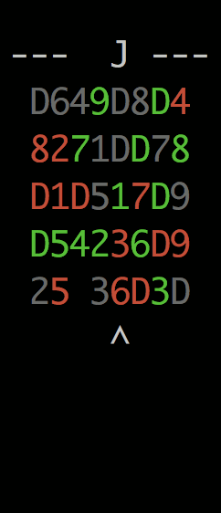
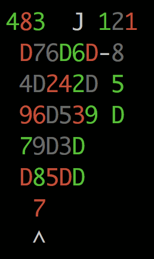

# shenzhen-solitaire-solver
:dragon_face: Solver for Shenzhen IO's solitaire minigame. A project with which to learn Rust.



## Compiling from source
Clone the repo locally, [install rust](https://www.rust-lang.org/en-US/install.html?), and run
`cargo build --release` to compile. The executable will be compiled to
`target/release/shenzhen-solitaire-solver`.

## Usage
```
usage: target/release/shenzhen-solitaire-solver {play,solve} [seed]
```
When you run either `play` or `solve` a random board will be generated, and its seed will be
printed. To play or solve this same board again, you may pass this seed as an argument.

## Play

Controls:

- WASD to move the cursor (until I can figure out how to support the arrow keys)
- Space to select or place a card
- G to group the selected dragons
- C to cancel a selection
- 1-8 to jump within the current row
- ? to show these controls

The goal of the game is to stack all of the number cards by suit in order on the top right, to
group all of the dragon cards by suit in the free cells in the top left, and to move the joker card
(`J`) to the top-center.

A number card may be stacked in the main game area on a number card of one-higher rank and
differing suit. Stacks of this kind may be moved as a unit. If all four dragon cards of one suit
(represented by a `D`) are uncovered and there exists an open free cell, they may be all be grouped
into that cell where they remain for the rest of the game.

Cards which may safely be moved to a goal area will be moved automatically.

When moving a stack of number cards to an empty space you will need to specify how much of the
stack you'd like to move. Use S and W to choose, and Space to select.



## Solve

Attempts to solve the game using the [A* algorithm](https://en.wikipedia.org/wiki/A*_search_algorithm) with a not-quite admissable heuristic, and
prints out each intermediate board state. In practice this means it will usually find a solution
relatively quickly if one exists, although not necessarily the solution with the fewest number of
moves. In particular the solver may unnecessarily move a number card to the goal area.
